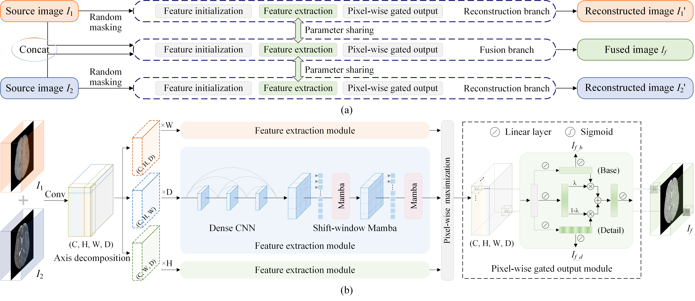

# LPM-Net: Lightweight pixel-level modeling network based on CNN and Mamba for 3D medical image fusion
 

keywords: Image fusion, Deep learning, 3D medical image, Mamba, Convolutional neural network

## Introduction:

In this work, a lightweight pixel-level modeling network (LPM-Net) is proposed to achieve faster and more effective 3D medical image fusion. Firstly, our method operates at full resolution to model pixel-wise features without downsampling, and combines base and detail components through a gated module to generate the fused image directly. Secondly, we employ an axis decomposition method and an optimized state space model Mamba instead of the Transformer to reduce computa tional burden. Thirdly, two reconstruction branches are devised as supplementary supervised tasks, where the corresponding supervised loss functions are seamlessly integrated with the unsupervised loss functions to boost the fusion performance of the LPM-Net.

## User Guide:
This work is implemented by **PyTorch**

`./main.py` and `./engine.py` are the main script and the training/testing engine for LPM-Net.

`./run_example.sh` show the examples of how to run the code.

Note that the `--gamma` parameter may require fine-tuning to adapt to the characteristics of the target dataset.

The datasets used in this work can be found at: [BraTS2020](https://www.med.upenn.edu/cbica/brats2020/data.html), [IXI](http://brain-development.org/), [RESECT](https://curious2018.grand-challenge.org/Data/), [MMWHS2017](https://zmiclab.github.io/zxh/0/mmwhs/), [Prostate](https://wiki.cancerimagingarchive.net/pages/viewpage.action?pageId=23691514), and [HNSCC](https://wiki.cancerimagingarchive.net/pages/viewpage.action?pageId=52763679#52763679e5e64bb94e9948a0ac174b4a539b336a).

The data preprocessing code is available in the `./datasets` directory.

## Evaluation Metrics:
We use the following evaluation metrics to measure the performance of image fusion:
1. Structure similarity index measure ([SSIM](./models/losses.py#L51))
2. Edge-based fusion metric Q^AB/F^ ([Qabf](./models/losses.py#L116))
3. Mutual information ([MI](./models/losses.py#L251))
4. Sum of the correlations of differences ([SCD](./models/losses.py#L273))
5. Visual information fidelity of fusion ([VIFF](./models/losses.py#L339))
6. Average gradient ([AG](./models/losses.py#L345))
7. Standard deviation ([SD](./models/losses.py#L374))
8. Ratio of spatial frequency error ([rSFe](./models/losses.py#L387))

## Citation:
If you find this code is useful in your research, please consider to cite:

## Example Results:
### Quantitative Results:

### Qualitative comparisons:
**BraTS2020:**

**IXI:**

**RESECT:**

**MMWHS2017:**

**Prostate:**

**HNSCC:**

